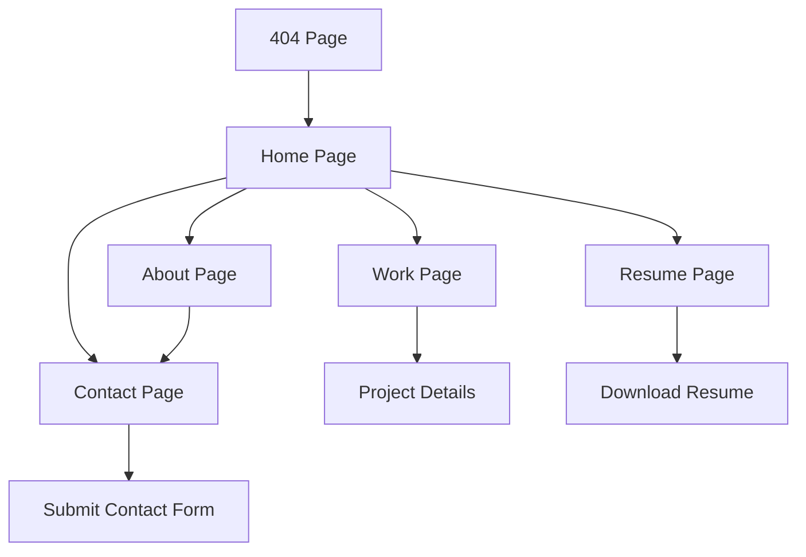

# Smriti Shrestha Portfolio Website - Product Requirements Document

## 1. Product Overview
A modern, professional personal portfolio website for Smriti Shrestha, a UI/UX Designer, showcasing her design work, skills, and experience with a distinctive lavender color theme.

The portfolio aims to establish her professional online presence, attract potential clients and employers, and demonstrate her design capabilities through an elegant, accessible, and high-performing website.

## 2. Core Features

### 2.1 User Roles
No user role distinction is necessary for this portfolio website. All visitors have the same access level to view content and contact Smriti.

### 2.2 Feature Module
Our portfolio website consists of the following main pages:
1. **Home page**: Hero section with lavender gradient, featured projects showcase, quick skill tags display.
2. **Work page**: Project grid layout, detailed project cards with images and descriptions.
3. **About page**: Personal bio, professional strengths, fun facts, external profile links.
4. **Resume page**: Formatted CV display, downloadable PDF resume.
5. **Contact page**: Contact form, direct contact information, social media links.
6. **404 page**: Friendly error page with navigation back to main site.

### 2.3 Page Details

| Page Name | Module Name | Feature description |
|-----------|-------------|---------------------|
| Home page | Hero section | Display name, role, location with lavender gradient background, call-to-action buttons |
| Home page | Featured projects | Showcase 2-3 key projects with preview images, titles, and brief descriptions |
| Home page | Skills overview | Display core skills as interactive tags with hover effects |
| Work page | Project grid | Display all projects in responsive grid layout with filtering capabilities |
| Work page | Project cards | Show project images, role, description, technologies used, and external links |
| About page | Personal bio | Display comprehensive background, passion for design, and career goals |
| About page | Strengths section | Highlight key professional strengths and design philosophy |
| About page | External links | Provide links to Upwork profile, Figma projects, and other professional platforms |
| Resume page | CV display | Present education, experience, skills in formatted layout |
| Resume page | Download functionality | Enable PDF resume download with tracking |
| Contact page | Contact form | Collect name, email, message with form validation and submission |
| Contact page | Direct contact | Display clickable email, phone number, and location |
| Contact page | Social links | Provide links to professional social media profiles |
| 404 page | Error message | Display friendly error message with lavender accent styling |
| 404 page | Navigation | Provide clear navigation back to main site sections |

## 3. Core Process

**Visitor Flow:**
Visitors typically start on the Home page to get an overview of Smriti's work, then navigate to the Work page to explore projects in detail. They may visit the About page to learn more about her background and the Resume page to view her qualifications. Finally, interested visitors use the Contact page to reach out for opportunities.

## 4. User Interface Design

### 4.1 Design Style
- **Primary Colors**: Lavender (#A78BFA), Deep Violet (#7C3AED)
- **Secondary Colors**: Blush Pink (#F9A8D4), Mint Accent (#34D399)
- **Backgrounds**: Light (#FDFBFF), Dark (#0F0A19)
- **Typography**: Neutral Heading (#1F1B24), Neutral Body (#6B7280)
- **Button Style**: Rounded corners with gradient backgrounds and smooth hover transitions
- **Font**: Modern sans-serif with multiple weights (300, 400, 600, 700)
- **Layout Style**: Clean, minimalist design with card-based components and generous white space
- **Icons**: Consistent icon set with lavender accent colors and smooth animations

### 4.2 Page Design Overview

| Page Name | Module Name | UI Elements |
|-----------|-------------|-------------|
| Home page | Hero section | Large typography, lavender-to-blush gradient background, floating animation effects, CTA buttons with hover states |
| Home page | Featured projects | Card layout with image overlays, subtle shadows, hover zoom effects |
| Home page | Skills overview | Pill-shaped tags with lavender backgrounds, hover color transitions |
| Work page | Project grid | Masonry-style grid, filter buttons with active states, smooth transitions |
| Work page | Project cards | Image galleries, typography hierarchy, external link buttons with icons |
| About page | Personal bio | Two-column layout, professional headshot, readable typography |
| About page | Strengths section | Icon-based layout with lavender accents, animated counters |
| Resume page | CV display | Clean timeline design, section dividers, downloadable PDF styling |
| Contact page | Contact form | Floating labels, validation states, submit button with loading animation |
| Contact page | Direct contact | Clickable contact cards with hover effects and icons |

### 4.3 Responsiveness
The website is designed mobile-first with responsive breakpoints for tablet and desktop. Touch interactions are optimized for mobile devices, including larger tap targets and swipe gestures for project galleries. Dark mode support is implemented with automatic system preference detection and manual toggle option.