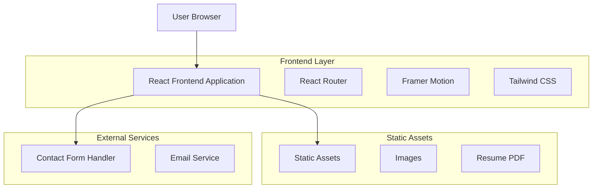
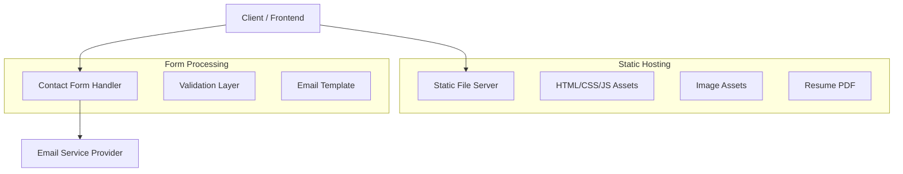
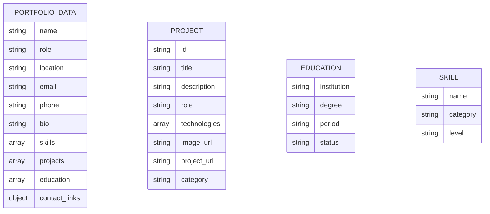

# Smriti Shrestha Portfolio Website - Technical Architecture Document

## 1. Architecture Design



## 2. Technology Description
- Frontend: React@18 + TypeScript@5 + Vite@5 + Tailwind CSS@3 + Framer Motion@11 + React Router@6
- Build Tool: Vite with TypeScript support
- Styling: Tailwind CSS with custom color palette configuration
- Animation: Framer Motion for smooth transitions and micro-interactions
- Deployment: Static hosting (Vercel/Netlify recommended)

## 3. Route Definitions

| Route | Purpose |
|-------|----------|
| / | Home page with hero section, featured projects, and skills overview |
| /work | Work portfolio page displaying all projects in grid layout |
| /about | About page with personal bio, strengths, and external profile links |
| /resume | Resume page with formatted CV and PDF download functionality |
| /contact | Contact page with form, direct contact info, and social links |
| /404 | Custom 404 error page with navigation back to main site |

## 4. API Definitions

### 4.1 Core API

Contact form submission
```
POST /api/contact
```

Request:
| Param Name | Param Type | isRequired | Description |
|------------|------------|------------|-------------|
| name | string | true | Full name of the person contacting |
| email | string | true | Valid email address for response |
| message | string | true | Message content (max 1000 characters) |

Response:
| Param Name | Param Type | Description |
|------------|------------|-------------|
| success | boolean | Whether the message was sent successfully |
| message | string | Response message or error details |

Example Request:
```json
{
  "name": "John Doe",
  "email": "john@example.com",
  "message": "Hi Smriti, I'd like to discuss a potential project collaboration."
}
```

Example Response:
```json
{
  "success": true,
  "message": "Thank you for your message! I'll get back to you soon."
}
```

## 5. Server Architecture Diagram



## 6. Data Model

### 6.1 Data Model Definition

Since this is a static portfolio website, there is no traditional database. However, the content is structured as follows:



### 6.2 Data Definition Language

Content Structure (TypeScript interfaces)
```typescript
// Portfolio data types
interface PortfolioData {
  personal: {
    name: string;
    role: string;
    location: string;
    email: string;
    phone: string;
    bio: string;
    profileImage: string;
  };
  skills: Skill[];
  projects: Project[];
  education: Education[];
  socialLinks: SocialLink[];
}

interface Project {
  id: string;
  title: string;
  description: string;
  role: string;
  technologies: string[];
  imageUrl: string;
  projectUrl?: string;
  category: 'web' | 'mobile' | 'design';
  featured: boolean;
}

interface Education {
  institution: string;
  degree: string;
  period: string;
  status: 'completed' | 'ongoing' | 'expected';
}

interface Skill {
  name: string;
  category: 'design' | 'technical' | 'soft';
  level: 'basic' | 'intermediate' | 'advanced';
}

interface SocialLink {
  platform: string;
  url: string;
  icon: string;
}

// Contact form types
interface ContactFormData {
  name: string;
  email: string;
  message: string;
}

interface ContactResponse {
  success: boolean;
  message: string;
}
```

Static Data Configuration
```typescript
// src/data/portfolio.ts
export const portfolioData: PortfolioData = {
  personal: {
    name: "Smriti Shrestha",
    role: "UI/UX Designer",
    location: "Lubhu, Lalitpur, Nepal",
    email: "smrityshrestha734@gmail.com",
    phone: "+977-9813708697",
    bio: "Motivated and creative Computer Science student passionate about user-centered design...",
    profileImage: "/assets/profile-image.jpg"
  },
  skills: [
    { name: "Figma", category: "design", level: "advanced" },
    { name: "Wireframing", category: "design", level: "advanced" },
    { name: "Prototyping", category: "design", level: "advanced" },
    // ... more skills
  ],
  projects: [
    {
      id: "recruitment-portal",
      title: "Recruitment Portal Web App",
      description: "Internship project focusing on UI/UX Design for a comprehensive recruitment platform",
      role: "UI/UX Designer",
      technologies: ["Figma", "User Research", "Wireframing"],
      imageUrl: "/assets/project-recruitment.png",
      category: "web",
      featured: true
    },
    {
      id: "jewelaura",
      title: "JewelAura",
      description: "Personal project - Mobile App Design for jewelry e-commerce platform",
      role: "UI/UX Designer",
      technologies: ["Figma", "Mobile Design", "Prototyping"],
      imageUrl: "/assets/project-jewelaura.png",
      category: "mobile",
      featured: true
    }
  ],
  education: [
    {
      institution: "Herald College Kathmandu",
      degree: "Bachelor's in Computer Science",
      period: "2024–2026",
      status: "expected"
    },
    {
      institution: "DAV College",
      degree: "+2 in Science",
      period: "2021–2023",
      status: "completed"
    }
  ],
  socialLinks: [
    {
      platform: "Upwork",
      url: "#", // Replace with actual Upwork profile
      icon: "upwork"
    },
    {
      platform: "Figma",
      url: "#", // Replace with actual Figma profile
      icon: "figma"
    }
  ]
};
```